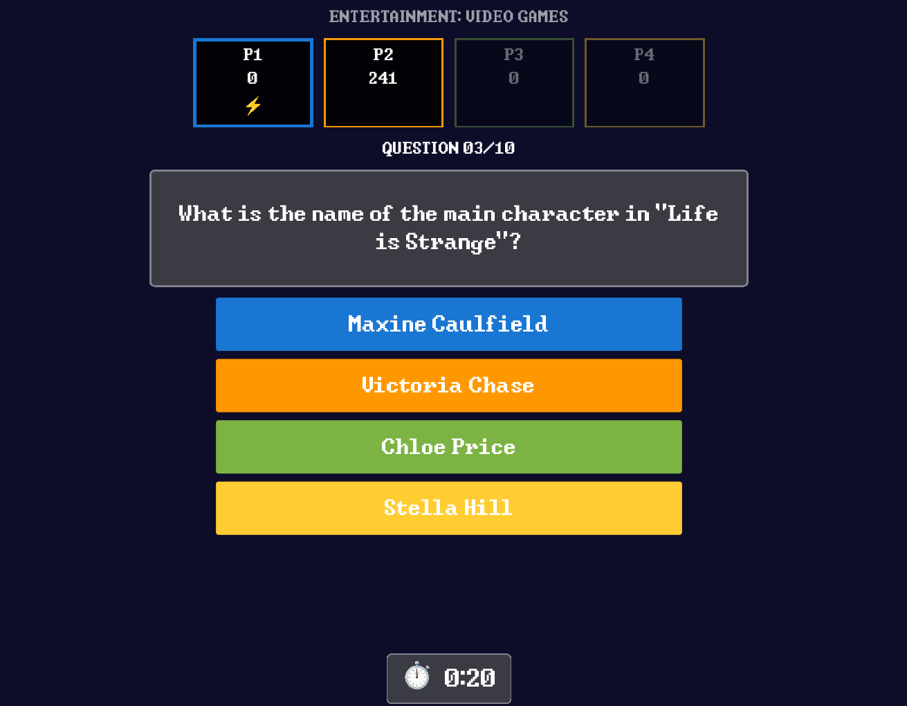

# 🎮 Rebuzzed 🎮

Rebuzzed is a quiz and trivia game for up to 4 players. The game uses
PlayStation Buzz USB controllers, and it is built with
[Godot 4.7](https://godotengine.org/). Quiz content comes from
[opentdb.com](https://opentdb.com/) (Open Trivia Database) format JSON files.



## Features

- **4-player multiplayer.** Up to 4 players join with the red buzzer on the
  Buzz controller and race to lock in answers.
- **Buzz controller and keyboard support.** The game gives full controller
  support, with a keyboard fallback for testing without hardware (see
  [Keyboard controls](#keyboard-controls)).
- **opentdb.com quiz format.** A player can add any number of opentdb-format
  JSON files to `data/`. The game pools every question from every file
  together and shuffles them. Quiz files stay external and user-editable,
  not baked into the game binary.
- **Difficulty-based scoring.** Base points scale with the difficulty of the
  question (easy, medium, or hard), plus a speed bonus for a fast lock-in.
- **"First to lock in" highlight.** The fastest player each round gets a
  gold border and a ⚡ badge.
- **Saved player names.** The game remembers names typed in the lobby for
  the next session.

## Requirements

- [Godot 4.7](https://godotengine.org/) (to run from source or export builds)
- PlayStation Buzz USB controllers (optional — keyboard works too)
- Windows/macOS/Linux

## Running

Open `project.godot` in the Godot editor and press **Play**, or run headless from
the command line:

```bash
godot --path .
```

### Exporting a build

The project includes an export preset for Linux (`export_presets.cfg`). To
build, run:

```bash
godot --headless --export-release "Linux" builds/linux/rebuzzed.x86_64
```

Quiz data lives outside the exported binary and the `.pck` file (see
[Quiz content](#quiz-content)). Copy the `data/` folder next to the exported
executable after the build.

## Controls

### Buzz Controller

| Button | Lobby | During a Question |
|--------|-------|--------------------|
| 🔴 Red | Join the game | Lock in your selected answer |
| 🟦 Blue | Part of the start sequence | Select the blue answer |
| 🟧 Orange | Part of the start sequence | Select the orange answer |
| 🟩 Green | Part of the start sequence | Select the green answer |
| 🟨 Yellow | Part of the start sequence | Select the yellow answer |

Once at least one player joins, enter the sequence 🟦 → 🟧 → 🟩 → 🟨 (from any
player, on any controller) to start the game.

Hold 🟦 and 🟨 together, from any single player, at any point during a game.
This opens a "return to lobby" confirmation. Red confirms. Any other button
cancels.

### Keyboard controls

Used as a testing convenience for play without physical controllers.

| Player | Join / Lock in | Blue | Orange | Green | Yellow |
|--------|-----------------|------|--------|-------|--------|
| P1 | `1` / `Enter` / `Space` | `Q` | `A` | `Z` / `Y` | `X` |
| P2 | `3` | `E` | `D` | `C` | `V` |
| P3 | `5` | `T` | `G` | `B` | `N` |
| P4 | `7` | `U` | `J` | `K` | `L` |

`F11` toggles fullscreen. `ESC` also opens the "return to lobby"
confirmation during a game.

## Quiz content

Add any number of [opentdb.com](https://opentdb.com/api_config.php)-format
JSON files to the `data/` folder (see `data/music-opentdb.json` for an
example).

The game pools every question from every file together, and shuffles them
into a random order each game. Base points per question scale with the
difficulty of the question (`easy` = 100, `medium` = 150, `hard` = 200),
plus a speed bonus for a fast lock-in.

The `data/` folder also holds `settings.json` (saved player names). The
game creates this file automatically, and it is not part of the exported
build. You can edit both files without a rebuild of the game.

## Project structure

```
rebuzzed/
├── project.godot
├── data/                     # External, user-editable: quiz JSON files + saved settings
├── assets/fonts/             # Press Start 2P + bundled color-emoji fallback
├── scenes/
│   ├── main.tscn             # Root: swaps between lobby/game/game-over
│   ├── screens/              # Lobby, gameplay, game-over screens
│   ├── components/           # Answer button, player score box, pie timer
│   └── debug/                # Standalone controller button-mapping test scene
└── scripts/
	├── autoload/             # QuizEngine, GameState, InputManager, FontSetup
	├── screens/
	└── components/
```

## Verifying the Buzz Controller Button Mapping

Buzz controllers report as a single USB HID device with 20 buttons (4
players × 5 buttons each). But the raw button index that Godot sees is not
guaranteed to match the index hardcoded in
`scripts/autoload/input_manager.gd`.

Run `scenes/debug/controller_test.tscn` directly in the editor. Press buttons
on a real controller. If needed, correct `InputManager.BUTTON_MAP` to
match.

## Acknowledgments

This project follows the idea of
[gardenofegan/buzz-controller-quiz-game](https://github.com/gardenofegan/buzz-controller-quiz-game),
an Electron and JavaScript version of the same game.

The project maintainers used generative AI tools during development.

## License

Rebuzzed licenses its code under the [GNU GPL v3.0](LICENSE).

Bundled fonts keep their own licenses, not GPL:
[Press Start 2P](assets/fonts/PressStart2P-OFL.txt) and
[Noto Color Emoji](assets/fonts/NotoColorEmoji-OFL.txt) both come from the
Google Noto and Press Start 2P projects, under the SIL Open Font License
1.1. Noto Color Emoji also offers a dual
OFL-1.1/[Apache-2.0](assets/fonts/NotoColorEmoji-LICENSE-Apache-2.0.txt)
license.
